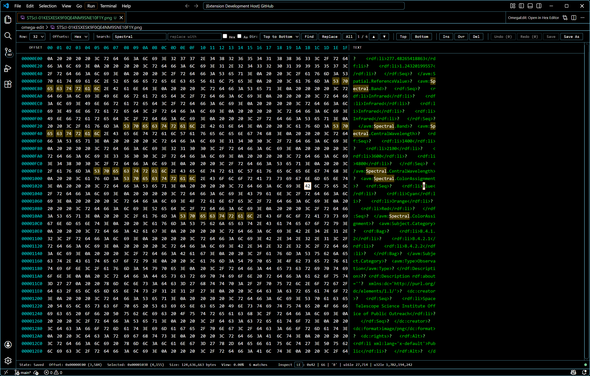

# Ωedit™ Hex Editor - Reference VS Code Extension

A standalone reference VS Code extension that demonstrates how to use [Ωedit™](https://github.com/ctc-oss/omega-edit) as a fast, usable data/hex editor. It is still intentionally smaller than a marketplace-grade product, but it now covers the core editing, navigation, save, replay, and testing paths needed to evaluate a serious integration.



## What This Demonstrates

| Integration Point                                         | Where                                                                               |
| --------------------------------------------------------- | ----------------------------------------------------------------------------------- |
| Start Ωedit™ server on `activate()`                       | [extension.ts](src/extension.ts)                                                    |
| Stop server on `deactivate()`                             | [extension.ts](src/extension.ts)                                                    |
| `CustomReadonlyEditorProvider` wired to Ωedit™            | [hexEditorProvider.ts](src/hexEditorProvider.ts)                                    |
| Direct open from command palette / explorer               | [extension.ts](src/extension.ts)                                                    |
| Create session per opened file                            | [hexEditorProvider.ts](src/hexEditorProvider.ts)                                    |
| Viewport to webview data flow                             | [hexEditorProvider.ts](src/hexEditorProvider.ts)                                    |
| Insert / delete / overwrite / replace from UI             | [hexEditorProvider.ts](src/hexEditorProvider.ts) + [webview.ts](src/webview.ts)     |
| Search and replace with text/hex and direction controls   | [hexEditorProvider.ts](src/hexEditorProvider.ts) + [webview.ts](src/webview.ts)     |
| Undo / redo with stack counts                             | [hexEditorProvider.ts](src/hexEditorProvider.ts) + [webview.ts](src/webview.ts)     |
| Save / Save As / dirty tracking                           | [hexEditorProvider.ts](src/hexEditorProvider.ts) + [webview.ts](src/webview.ts)     |
| Export / replay JSON change scripts                       | [hexEditorProvider.ts](src/hexEditorProvider.ts) + [extension.ts](src/extension.ts) |
| Bytes-per-row and offset-radix controls                   | [webview.ts](src/webview.ts)                                                        |
| Status bar, binary inspector, and server health indicator | [webview.ts](src/webview.ts)                                                        |
| Extension settings                                        | [package.json](package.json)                                                        |

## Quick Start

### Prerequisites

- [Node.js](https://nodejs.org/) >= 18
- [VS Code](https://code.visualstudio.com/) >= 1.110

The current VS Code floor is `1.110` because that is the oldest version exercised in CI and it matches the `@types/vscode` version used to compile the example. If the support range is widened later, the CI matrix should be widened with it.

This reference extension intentionally depends on the in-repo `@omega-edit/client` package through a local `file:` dependency. That keeps the example and CI aligned with the current Ωedit™ 2.x client implementation in this checkout instead of a separately published npm version.

### Run With F5

```bash
cd examples/vscode-extension
npm install
npm test
```

Then open this folder in VS Code and press `F5`. A new Extension Development Host window will open.

In the new window:

- Run `Ωedit™: Open in Hex Editor` from the Command Palette to pick any file directly
- Or right-click a file in the Explorer and choose `Ωedit™: Open in Hex Editor`

## What Happens Under The Hood

1. `activate()` reads the `omegaEdit.serverPort` setting and starts the bundled native server through `@omega-edit/client`.
2. Opening a file creates an Ωedit™ session and viewport, then subscribes to viewport and session updates.
3. The native server now uses server-managed checkpoint directories under the host temp directory for auto-managed sessions, which keeps checkpoint artifacts out of the source file's folder and makes cleanup predictable.
4. The webview drives edits, navigation, search, replace, save, and replay through the provider, and the provider pushes back reactive state updates for the viewport, undo/redo counts, dirty state, replace counts, and server health.
5. `deactivate()` calls `stopServerGraceful()` so the server can shut down cleanly.

## Extension Settings

| Setting                 | Default | Description                                                                |
| ----------------------- | ------- | -------------------------------------------------------------------------- |
| `omegaEdit.serverPort`  | `9000`  | gRPC server port                                                           |
| `omegaEdit.logLevel`    | `info`  | Client log level (`trace` / `debug` / `info` / `warn` / `error` / `fatal`) |
| `omegaEdit.bytesPerRow` | `16`    | Bytes displayed per row (8 / 16 / 32)                                      |

## Keyboard Shortcuts

| Key                      | Action                                                     |
| ------------------------ | ---------------------------------------------------------- |
| `Ctrl+Z`                 | Undo                                                       |
| `Ctrl+Y`                 | Redo                                                       |
| `Ctrl+S`                 | Save                                                       |
| `Ctrl+Shift+S`           | Save As                                                    |
| `Ctrl+F`                 | Focus search                                               |
| Arrow keys               | Move selection, or scroll by line when nothing is selected |
| `Page Up` / `Page Down`  | Scroll by 32 rows                                          |
| `Ctrl+Home` / `Ctrl+End` | Jump to start / end                                        |
| Mouse wheel              | Scroll by 4 rows                                           |

## Testing

The example is exercised in CI on Linux and Windows against both the declared VS Code floor and latest stable release.

Useful local commands:

```bash
npm run lint
npm run format:check
npm run compile
npm run test:unit
VSCODE_VERSION=1.110.0 npm run test:integration
VSCODE_VERSION=stable npm run test:integration
```

`npm run lint` now uses Biome for the extension's JavaScript, TypeScript, and JSON sources/config. Biome does not currently format Markdown, so `README.md` stays outside the automated formatter scope for this example.

## Packaging And Release

Build a local `.vsix` package with:

```bash
npm run package:vsix
```

That writes `omega-edit-hex-editor.vsix` in this folder after running the normal `vscode:prepublish` compile step.

The repository's tagged release workflow also builds this extension and uploads the packaged `.vsix` to the GitHub release assets alongside the other release artifacts.

## Architecture

```text
+--------------------------------------------------------------+
| VS Code Extension Host                                       |
|  extension.ts                                                |
|   -> startServer() / stopServerGraceful()                    |
|   -> command registration                                    |
|   -> custom editor registration                              |
|                                                              |
|  hexEditorProvider.ts                                        |
|   -> createSession() / createViewport()                      |
|   -> event subscriptions                                     |
|   -> search / replace / save / replay                        |
|   -> webview state sync                                      |
|                                                              |
|  webview.ts                                                  |
|   -> hex + text rendering                                    |
|   -> virtual navigation controls                             |
|   -> toolbar / dialogs / status bar                          |
+-----------------------------+--------------------------------+
                              |
                              | gRPC
                              v
+--------------------------------------------------------------+
| Ωedit™ native server                                         |
|  - sessions, viewports, undo/redo                            |
|  - checkpoint handling                                       |
|  - save and replay support                                   |
|  - server info / heartbeat                                   |
+--------------------------------------------------------------+
```

## Extending This Example

This reference implementation is intentionally compact. A few natural next steps are:

- Switch from `CustomReadonlyEditorProvider` to `CustomEditorProvider` for full VS Code dirty-document integration
- Add multiple coordinated viewports or overview panels
- Surface richer profiling / structure analysis views
- Add bookmarks and richer navigation helpers
- Share session IDs across instances for collaborative or multi-tool workflows

## Related

- [Ωedit™ TypeScript Examples](../typescript/) - Standalone Node.js examples using `@omega-edit/client`
- [@omega-edit/client on npm](https://www.npmjs.com/package/@omega-edit/client) - The client package used here
- [Apache Daffodil VS Code Extension](https://github.com/apache/daffodil-vscode) - Production extension using Ωedit™
