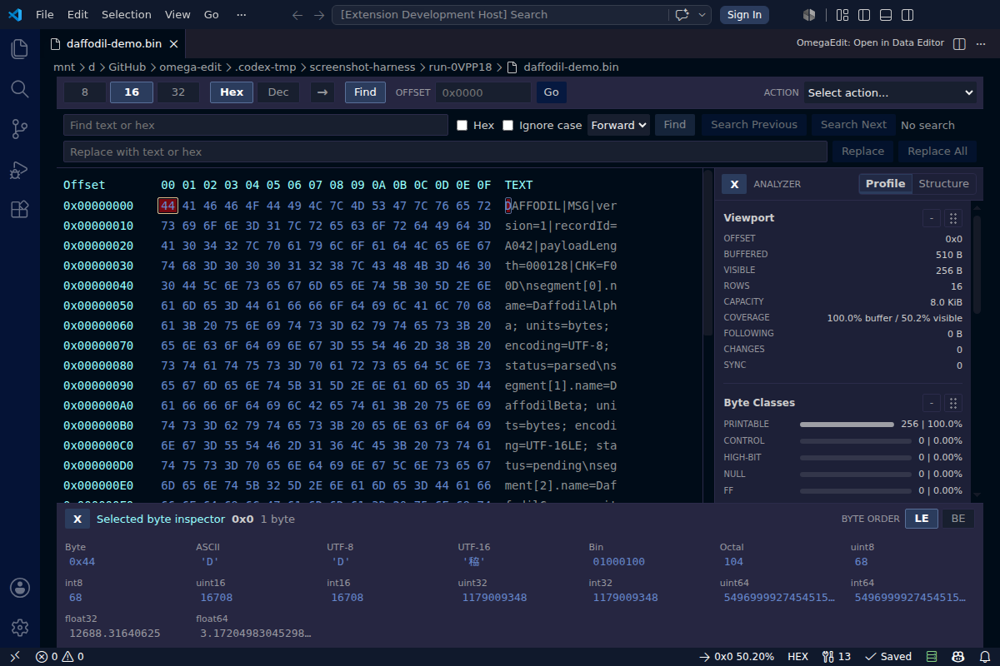
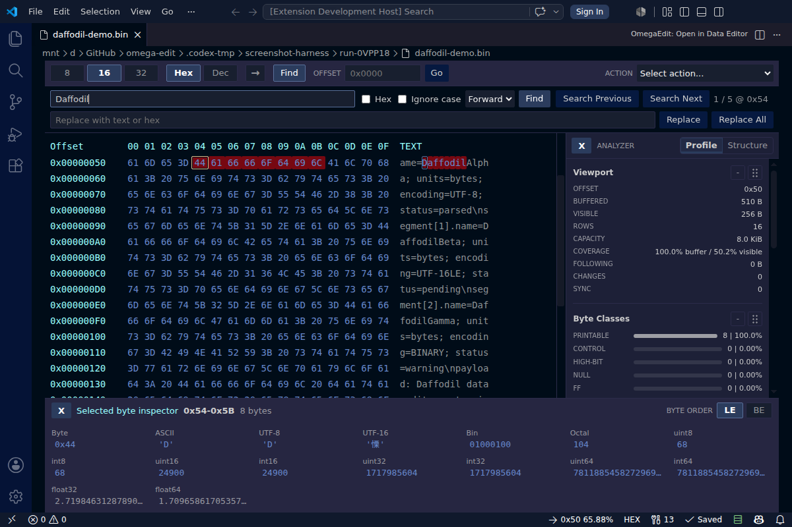
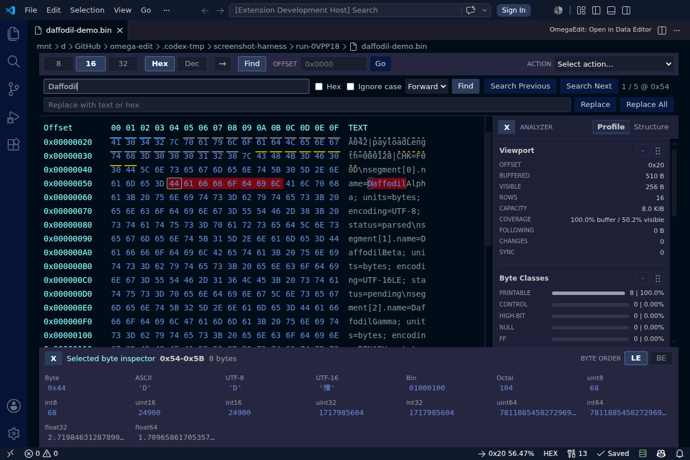
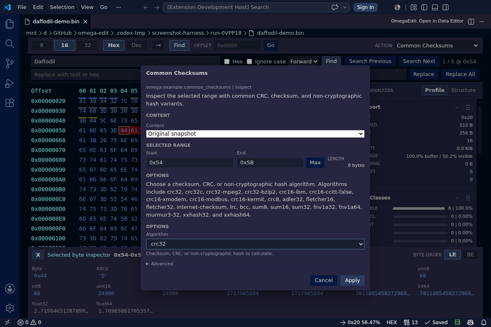

# Ωedit™ Data Editor - VS Code Extension

A standalone VS Code extension that uses [Ωedit™](https://github.com/ctc-oss/omega-edit) as a fast, usable data/hex editor. It covers the core editing, navigation, save, replay, and integration API paths needed for byte-level parser and debugger integrations.



## Feature Screenshots

**Search and replace with synchronized hex/text highlighting**



**External highlights for parser/debugger integrations**



**Transform plugins with inspectable content sources**



## What This Demonstrates

| Integration Point                                         | Where                                                                               |
| --------------------------------------------------------- | ----------------------------------------------------------------------------------- |
| Start Ωedit™ server on `activate()`                       | [extension.ts](src/extension.ts)                                                    |
| Stop server on `deactivate()`                             | [extension.ts](src/extension.ts)                                                    |
| `CustomEditorProvider` wired to Ωedit™ (dirty-doc integration) | [hexEditorProvider.ts](src/hexEditorProvider.ts)                               |
| Direct open from command palette / explorer               | [extension.ts](src/extension.ts)                                                    |
| Create session per opened file                            | [hexEditorProvider.ts](src/hexEditorProvider.ts)                                    |
| Viewport to webview data flow                             | [hexEditorProvider.ts](src/hexEditorProvider.ts)                                    |
| Insert / delete / overwrite / replace from UI             | [hexEditorProvider.ts](src/hexEditorProvider.ts) + [App.svelte](webview-ui/src/App.svelte) |
| Search and replace with text/hex and direction controls   | [hexEditorProvider.ts](src/hexEditorProvider.ts) + [SearchPanel.svelte](webview-ui/src/components/SearchPanel.svelte) |
| Discover and apply byte range transform plugins           | [hexEditorProvider.ts](src/hexEditorProvider.ts) + [TransformPanel.svelte](webview-ui/src/components/TransformPanel.svelte) |
| VS Code undo / redo with Structure-pane stack counts      | [hexEditorProvider.ts](src/hexEditorProvider.ts) + [ProfilerPanel.svelte](webview-ui/src/components/ProfilerPanel.svelte) |
| VS Code dirty-document tracking (`onDidChangeCustomDocument`) | [hexEditorProvider.ts](src/hexEditorProvider.ts)                                    |
| VS Code-initiated save / save-as / revert / backup            | [hexEditorProvider.ts](src/hexEditorProvider.ts)                                    |
| Export / apply JSON change logs                           | [hexEditorProvider.ts](src/hexEditorProvider.ts) + [extension.ts](src/extension.ts) |
| Bytes-per-row and offset-radix controls                   | [Toolbar.svelte](webview-ui/src/components/Toolbar.svelte)                         |
| Native VS Code status-bar items, binary inspector, and server health indicator | [hexEditorProvider.ts](src/hexEditorProvider.ts) + [ByteInspector.svelte](webview-ui/src/components/ByteInspector.svelte) |
| Profiling and structure analysis side pane                | [hexEditorProvider.ts](src/hexEditorProvider.ts) + [ProfilerPanel.svelte](webview-ui/src/components/ProfilerPanel.svelte) |
| Extension settings                                        | [package.json](package.json)                                                        |

Change log exports are portable `omega-edit.change-log` documents containing
the byte operations needed to apply the same edits to another session, another
file, or a fleet of compatible files. Change-log integer fields are decimal
int64 values in JSON, and local-file exports stream entries to a temporary file
before renaming the completed document into place. Exports include before/after
content fingerprints, and OmegaEdit refuses to write or apply incomplete change
logs when required change details are unavailable.

## Checkpoint Timeline

Run **OmegaEdit: Show Checkpoint Timeline** from the Command Palette or the
editor title bar to reveal the checkpoint slider. The slider is keyboard
accessible: focus it and use the arrow, Page Up/Page Down, Home, or End keys.
The adjacent buttons move exactly one checkpoint at a time.

- **Original** is the byte content from when the editor session opened. It is
  checkpoint zero; it does not mean the file's current on-disk contents after
  later saves.
- **Last Saved** is tracked by a SHA-256 content fingerprint, so Save and Auto
  Save do not erase checkpoint history. Creating a checkpoint immediately
  after Auto Save is supported.
- Moving away from the last-saved fingerprint makes the editor dirty. Returning
  to the same fingerprint makes the timeline state clean again.
- Rewinding and fast-forwarding do not create a branch. The first successful
  byte-changing edit made while rewound removes the abandoned forward branch;
  cancelled and no-op edits do not.
- A red/unavailable marker means its durable replay archive failed validation
  or requires a missing transform plugin. OmegaEdit disables unsafe movement
  across that boundary and leaves the current bytes unchanged.

Timeline archives are temporary and storage-backed; payloads are not retained
in the extension host heap. The defaults are 1 GiB per editor session, 5 GiB
across the history root, 1,000 checkpoints, and seven days for inaccessible
crash diagnostics. Active history is never silently pruned to satisfy a quota:
the checkpoint is marked unavailable and ordinary editing remains enabled.
Cleanly closing an editor removes its ephemeral timeline storage because native
checkpoint stacks do not survive the session.

## Client Helpers Used Here

The example now leans on higher-level editor-facing helpers from `@omega-edit/client` instead of rolling its own integration glue:

| Helper                      | Role in the extension                                                               |
| --------------------------- | ------------------------------------------------------------------------------------ |
| `ScopedEditorSessionHandle` | Opens a session, creates or recreates the active viewport, owns subscriptions, cleans up |
| `EditorSessionModel`        | Tracks computed file size, change count, viewport identity, and sync waiters        |
| `EditorHistoryController`   | Tracks local vs checkpoint-backed undo/redo and save-state semantics                |
| `EditorSearchController`    | Owns bounded vs large search mode and routes replace-all to bounded or checkpointed flows |
| `listTransformPlugins()` / `applyTransformPlugin()` | Discovers native transform plugins, including option help/schema metadata, and applies them to the active byte selection |

## Quick Start

### Prerequisites

- [Node.js](https://nodejs.org/) 22 or newer; Node.js 24 is used by the primary CI lane and `.nvmrc`
- [VS Code](https://code.visualstudio.com/) >= 1.110

The current VS Code floor is `1.110` because that is the oldest version exercised in CI and it matches the `@types/vscode` version used to compile the example. If the support range is widened later, the CI matrix should be widened with it.

This extension intentionally depends on the in-repo `@omega-edit/client` package through a local `file:` dependency. That keeps the VS Code package and CI aligned with the current Ωedit™ 2.x client implementation in this checkout instead of a separately published npm version.

If you rebuild `packages/client` while iterating on the extension, run `npm install` in `vscode-extension` again so the local installed `file:` dependency picks up the refreshed `dist/` artifacts.

### Run With F5

```bash
cd vscode-extension
npm install
npm test
```

Then open this folder in VS Code and press `F5`. A new Extension Development Host window will open.

In the new window:

- Run `OmegaEdit: Open in Data Editor` from the Command Palette to pick any file directly
- Or right-click a file in the Explorer and choose `OmegaEdit: Open in Data Editor`

## What Happens Under The Hood

Current implementation note:

- The example no longer hand-rolls session lifecycle and editor bookkeeping in the provider.
- `ScopedEditorSessionHandle` owns session creation, viewport recreation, subscriptions, and cleanup.
- `EditorSessionModel` owns live session metadata and sync waiters.
- `EditorHistoryController` and `EditorSearchController` own the reusable undo/save-state and large-search behavior.

1. `activate()` starts the bundled native server through `@omega-edit/client`, using a Unix domain socket by default on macOS/Linux and TCP on Windows or when a port is explicitly configured. On Linux, the socket path is created under `XDG_RUNTIME_DIR` when available. Windows stays on TCP until the Node/gRPC stack supports Windows AF_UNIX reliably.
2. Opening a file creates an Ωedit™ session and viewport, then uses the client-managed heartbeat and subscription helpers for the steady-state connection wiring.
3. The native server now uses server-managed checkpoint directories under the host temp directory for auto-managed sessions, which keeps checkpoint artifacts out of the source file's folder and makes cleanup predictable.
4. The webview drives edits, navigation, search, replace, and transforms through the provider, while native VS Code actions handle undo, redo, save, save-as, and status-bar presentation. The provider pushes back reactive state updates for the viewport, Structure-pane undo/redo counts, dirty state, replace counts, transform results, and server health. Transform option help, examples, defaults, and JSON Schema validation come from the plugin metadata rather than hardcoded webview logic.
5. The analysis side pane profiles the current visible range or active multi-byte selection. The provider asks Ωedit™ for byte frequency and character-count data, while the webview renders a 256-bin frequency chart with linear/log scaling and derives local byte classes, mode, frequency-spread, top-byte summaries, entropy, and longest-run structure hints from the buffered data. Large selections are capped for profiling so exploratory range analysis does not monopolize the extension host.
6. `deactivate()` calls `stopServerGraceful()` so the server can shut down cleanly.

### Large Search Mode

The example extension uses a bounded search window of `1000` matches. It probes for `1001` matches so it can distinguish between:

- `bounded` mode, where the full match list is kept in memory because the result set fits in the window
- `large` mode, where match navigation switches to on-demand forward/backward search from the current cursor instead of storing every match offset

This mode decision is made only when the user runs an explicit search. If a replace operation changes the remaining match count across the `1000` threshold, the extension keeps the current mode until the next explicit search. For example, a search that starts in `large` mode with exactly `1001` matches stays in `large` mode after one single replacement leaves `1000` remaining matches.

## Extension Settings

| Setting                 | Default | Description                                                                |
| ----------------------- | ------- | -------------------------------------------------------------------------- |
| `omegaEdit.serverPort`  | `9000`  | TCP gRPC server port; setting this explicitly opts out of the default macOS/Linux Unix socket transport |
| `omegaEdit.logLevel`    | `info`  | Client log level (`trace` / `debug` / `info` / `warn` / `error` / `fatal`) |
| `omegaEdit.bytesPerRow` | `16`    | Bytes displayed per row (8 / 16 / 32)                                      |
| `omegaEdit.language`    | `auto`  | Svelte data editor UI language (`auto` follows VS Code; explicit options include `en` and `es`) |
| `omegaEdit.transformPluginDirectories` | `[]` | Native transform plugin directories; local build plugin folders are auto-detected when this is empty |
| `omegaEdit.allowExperimentalTransformPlugins` | `false` | Load experimental transform plugins from configured or bundled plugin directories |
| `omegaEdit.saveConflictFingerprintAlgorithm` | `sha256` | Digest used by the native guarded save path to confirm that an apparent conflict still matches OmegaEdit's last saved content |

## Keyboard Shortcuts

| Key                      | Action                                                     |
| ------------------------ | ---------------------------------------------------------- |
| `Ctrl+Z`                 | Native VS Code undo                                       |
| `Ctrl+Y`                 | Native VS Code redo                                       |
| `Ctrl+S`                 | Native VS Code save                                       |
| `Ctrl+Shift+S`           | Native VS Code save as                                    |
| `Ctrl+F`                 | Focus search                                               |
| Arrow keys               | Move selection, or scroll by line when nothing is selected |
| `Page Up` / `Page Down`  | Scroll by 32 rows                                          |
| `Ctrl+Home` / `Ctrl+End` | Jump to start / end                                        |
| Mouse wheel              | Scroll by 4 rows                                           |

## Testing

The example is exercised in CI on Linux, macOS, and Windows against both the declared VS Code floor and latest stable release.

Useful local commands:

```bash
npm run lint
npm run format:check
npm run compile
npm run test:unit
VSCODE_VERSION=1.110.0 npm run test:integration
VSCODE_VERSION=stable npm run test:integration
```

`npm run lint` now uses Biome for the extension's JavaScript, TypeScript, and JSON sources/config. Biome does not currently format Markdown, so `README.md` stays outside the automated formatter scope for this example.

## Packaging And Release

Build a local `.vsix` package with:

```bash
npm run package:vsix
```

That writes `omega-edit-data-editor.vsix` in this folder after running the normal `vscode:prepublish` compile step.

The repository's tagged release workflow also builds this extension and uploads the packaged `.vsix` to the GitHub release assets alongside the other release artifacts.

## Architecture

```text
+--------------------------------------------------------------+
| VS Code Extension Host                                       |
|  extension.ts                                                |
|   -> startServer() / stopServerGraceful()                    |
|   -> command registration                                    |
|   -> custom editor registration                              |
|                                                              |
|  hexEditorProvider.ts                                        |
|   -> createSession() / createViewport()                      |
|   -> session + viewport subscriptions as primary state sync  |
|   -> search / replace / save / replay                        |
|   -> webview state sync                                      |
|   -> heartbeat as the only intentional poll                  |
|                                                              |
|  svelteWebview.ts + webview-ui/                              |
|   -> Svelte bundle host, CSP, and VS Code resource wiring     |
|   -> hex + text rendering                                    |
|   -> virtual navigation controls                             |
|   -> profile / structure analysis side pane                  |
|   -> toolbar / dialogs                                       |
+-----------------------------+--------------------------------+
                              |
                              | gRPC
                              v
+--------------------------------------------------------------+
| Ωedit™ native server                                         |
|  - sessions, viewports, undo/redo                            |
|  - checkpoint handling                                       |
|  - save and replay support                                   |
|  - server info / heartbeat                                   |
+--------------------------------------------------------------+
```

Current implementation note:

- The architecture diagram above is still directionally correct, but the provider now reaches the lower-level session and subscription APIs through the client helpers listed above rather than wiring all of that behavior directly inside the example.

Subscription rule:

- This extension is intentionally subscription-first. Session state, computed file size, and viewport refreshes should come from event streams, not repeated snapshot polling.
- The extension uses the shared `@omega-edit/client` helpers for that wiring instead of hand-rolling raw stream setup in the example.
- Heartbeat is the only acceptable polling loop here, because the server uses it to detect dead clients and reap abandoned sessions.
- If you need any other poll to keep the extension correct, treat that as a design bug and fix the missing event-driven integration instead.

## Extending This Example

This implementation is intentionally compact. A few natural next steps are:

- Add multiple coordinated viewports or overview panels
- Add export actions for the analysis pane's profile and structure summaries
- Add bookmarks and richer navigation helpers
- Share session IDs across instances for collaborative or multi-tool workflows

For the planned Svelte/Vite webview migration, Daffodil debugger bridge, and
AI/LLM automation requirements, see
[Svelte Webview and Automation Requirements](docs/svelte-ai-migration-requirements.md).

### Svelte Webview

The extension uses the Svelte/Vite webview as the editor UI. To try it from an
Extension Development Host:

1. Run `npm run compile`.
2. Open a local file with `OmegaEdit: Open in Data Editor`.

The Svelte UI supports local byte selection, keyboard and wheel navigation,
host-backed search navigation, match highlighting on both the byte and text
columns, command-routed Search Next / Search Previous, search replace /
replace-all through the provider, active-pane Ctrl-C/Ctrl-X clipboard handling,
active-pane Ctrl-V insert handling, direct grid editing for hex bytes and
printable ASCII with Insert-key editing-mode toggling. The extension uses VS
Code's native status-bar behavior for overwrite mode: blank in insert mode and
`OVR` in overwrite mode. The UI also includes a
lightweight byte inspector with LE/BE contextual value editing for non-float
values including UTF-8 and UTF-16 when valid. Native VS Code status-bar items
show the active pane, current offset/progress, transform count, dirty state, and
color-coded server health with a disconnected icon when the server is
unavailable. The Server status-bar hover groups stable health, current
instance, and host/build metadata, while live server metrics remain in Analysis
> Structure > Server. The inspector is collapsible, inspector values highlight
their participating bytes in both grid panes, offsets can be shown in hex or
decimal, and the Analysis side pane supports reorderable and collapsible
sections. The webview derives visible rows from the editor pane height and
clamps virtual scrolling at file boundaries.

The Svelte webview localizes visible UI through
`webview-ui/src/i18n.ts`. The `omegaEdit.language` setting defaults to `auto`,
which follows VS Code's active display language from `vscode.env.language`.
Setting it to an explicit supported language such as `en` or `es` overrides the
webview language and makes localization easy to test without changing VS Code's
global display language. The selected language is passed into the webview HTML,
which sets the document `lang`, text direction, and selected string table before
Svelte mounts. English is the complete fallback locale, and locale entries such
as the initial `es` table may override only the strings they translate. New
Svelte UI should continue to read labels, titles, validation text, and
locale-sensitive decimal number formatting from the i18n helpers instead of
adding visible literals directly in components. VS Code contribution strings
remain in `package.nls.json`.

Generic parser/debugger integrations can call `omegaEdit.getEditorState`,
`omegaEdit.setExternalHighlights`, and `omegaEdit.clearExternalHighlights` to
read compact editor state and annotate byte ranges without scraping the webview.
External highlight kinds are generic (`current`, `parsed`, `error`, `warning`,
`breakpoint`, and `secondary`) so Daffodil, DFDL tools, and other byte-level
parsers can map their own concepts into the shared editor.

TypeScript extensions can also consume the typed API returned from activation.
The package declaration entrypoint is `out/api.d.ts`.

### Extension Dependency Contract

Downstream VS Code extensions should depend on the stable extension id
`ctc-oss.omega-edit-data-editor` and then activate the typed API. The API's
`version` property is the activation contract version, not the package version.

```json
{
  "extensionDependencies": ["ctc-oss.omega-edit-data-editor"]
}
```

```ts
import type { OmegaEditExtensionApi } from 'omega-edit-data-editor'

const extension = vscode.extensions.getExtension<OmegaEditExtensionApi>(
  'ctc-oss.omega-edit-data-editor'
)
const omegaEdit = await extension?.activate()

if (omegaEdit?.version !== 2) {
  throw new Error('Unsupported OmegaEdit Data Editor API version')
}

await omegaEdit?.open(document.uri, { offset: 128 })
const context = omegaEdit?.getAssistantContext({ uri: document.uri })
await omegaEdit?.setExternalHighlights({
  uri: document.uri,
  reveal: true,
  highlights: [
    {
      id: 'parser.current',
      offset: 128,
      length: 4,
      kind: 'current',
      label: 'Current parse point',
      source: 'DFDL',
    },
  ],
})
```

### Assistant Command Parity

Assistants and scripted integrations should use structured command/API results,
not webview scraping. The `omegaEdit.getAssistantContext` command and
`getAssistantContext()` extension API method return the current session id, file
path, computed/original sizes, selection, active viewport, undo/redo counts,
transform state, change-log status, and the command-surface map below.

| UI action | VS Code command | Extension API | CLI / MCP equivalent |
| --- | --- | --- | --- |
| Open a file | `omegaEdit.openInHexEditor` | `open` | `oe create-session` / `omega_edit_create_session` |
| Get assistant context | `omegaEdit.getAssistantContext` | `getAssistantContext` | `oe session-context` / `omega_edit_session_context` |
| Get raw editor state | `omegaEdit.getEditorState` | `getEditorState` | Context fields from `oe session-context` |
| Go to offset / read bytes | `omegaEdit.goToOffset` | `reveal` | `oe view` / `omega_edit_read_range` |
| Profile or search bytes | Search UI commands | n/a | `oe profile-range`, `oe search` / `omega_edit_profile_range`, `omega_edit_search` |
| Insert/delete/overwrite/replace | Webview edit actions | n/a | `oe patch` / `omega_edit_preview_patch`, `omega_edit_apply_patch` |
| Undo / redo | `omegaEdit.undo`, `omegaEdit.redo` | n/a | `oe undo`, `oe redo` / `omega_edit_undo`, `omega_edit_redo` |
| Transform plugins | `omegaEdit.refreshTransformPlugins` | n/a | `oe list-transform-plugins`, `oe apply-transform-plugin` / transform MCP tools |
| Checkpoints | Checkpoint commands | `createCheckpoint`, `restoreCheckpoint`, `rollbackCheckpoint` | Checkpoint CLI / MCP tools |
| Change logs | `omegaEdit.exportChangeLog`, `omegaEdit.applyChangeLog` | `exportChangeLog`, `applyChangeLog` | `oe export-change-log`, `oe apply-change-log` / change-log MCP tools |
| External highlights / range maps | Hidden annotation commands | Highlight and range-map API methods | VS Code API only |

### Daffodil Integration Notes

The Apache Daffodil integration audit maps the current downstream replacement
path to this activation API: Daffodil opens the configured debug data file with
`open`, mirrors `daffodil.data` byte-position events with
`setExternalHighlights({ reveal: true })`, and clears those annotations with
`clearExternalHighlights` when the debug session ends. Daffodil-owned surfaces
such as infoset display, infoset diff, parse-error dialogs, and leftover-data
messages remain outside the OmegaEdit dependency boundary.

See [docs/daffodil-vscode-integration-plan.md](docs/daffodil-vscode-integration-plan.md)
for the detailed audit mapping and remaining validation item.

## Related

- [Ωedit™ TypeScript Examples](../typescript/) - Standalone Node.js examples using `@omega-edit/client`
- [@omega-edit/client on npm](https://www.npmjs.com/package/@omega-edit/client) - The client package used here
- [Apache Daffodil VS Code Extension](https://github.com/apache/daffodil-vscode) - Production extension using Ωedit™
