## Introduction to Ωedit™

Ωedit™ is a back-end system for building editor front-ends.

Ωedit™ has a native library (written in C/C++), a native C++ gRPC server, and a TypeScript RPC client that uses HTTP/2 over TCP. Ωedit™ handles the editing bookkeeping and file I/O allowing the front-end to focus on presentation details. The front-end application creates one or more viewports that are subscribed to. Desired changes are then sent to the local Ωedit™ client, which communicates changes to the server, which then sends them into the library. Changes that affect the subscribed viewport(s) are communicated to the server, then to the client, and finally to the front-end which renders the data in the affected viewports. These round trips are fast and efficient (thousands of changes per second). This architecture allows for efficient (in both time and space) editing of very large files. Ωedit™ does not load the file being edited in memory, instead it keeps track of the changes, and can compute the changes for any given data segment or viewport on demand. This allows paging through the data with the edits applied, or have several viewports into the data all being kept up to date with all affecting changes being made.

## Quick Start

Choose the path that matches your use case. All five get you to a working edit in under five minutes.

### Path 1 — TypeScript / Node.js (recommended for IDE and tool authors)

Install the client package (which bundles the native gRPC server):

```bash
npm install @omega-edit/client
```

Create a file called `hello.ts`:

```typescript
import {
  startServer, getClient, createSession, destroySession,
  saveSession, insert, getComputedFileSize,
  stopServerGraceful, IOFlags,
} from '@omega-edit/client'

async function main() {
  // 1. Start the Ωedit™ server (bundled binary — no separate install needed)
  await startServer(9000)
  await getClient(9000)

  // 2. Create an empty editing session
  const session = await createSession()
  const sessionId = session.getSessionId()

  // 3. Insert some data
  await insert(sessionId, 0, Buffer.from('Hello, Ωedit™!'))
  const size = await getComputedFileSize(sessionId)
  console.log(`Session size: ${size} bytes`)

  // 4. Save to disk
  await saveSession(sessionId, 'hello-output.dat', IOFlags.IO_FLAGS_OVERWRITE)
  console.log('Saved to hello-output.dat')

  // 5. Clean up
  await destroySession(sessionId)
  await stopServerGraceful()
}

main().catch(console.error)
```

Run it:

```bash
npx ts-node hello.ts
```

> **Next steps:** See the [TypeScript examples](https://github.com/ctc-oss/omega-edit/tree/main/examples/typescript) for search, viewports, profiling, and record/replay. See the [reference VS Code extension](https://github.com/ctc-oss/omega-edit/tree/main/examples/vscode-extension) for a complete hex editor built on Ωedit™.

### Path 2 — C/C++ (native library)

Pre-built binaries for macOS (Apple Silicon + x64), Windows (x64), and Linux (ARM + x64) are [available on GitHub Releases](https://github.com/ctc-oss/omega-edit/releases).

To build from source with CMake:

```bash
cmake -S . -B _build -DCMAKE_BUILD_TYPE=Release
cmake --build _build --config Release
ctest --build-config Release --test-dir _build/core --output-on-failure
cmake --install _build --config Release --prefix _install
```

Or pull it into your own project via CMake `FetchContent`:

```cmake
include(FetchContent)
FetchContent_Declare(
  omega_edit
  GIT_REPOSITORY https://github.com/ctc-oss/omega-edit.git
  GIT_TAG        main
)
FetchContent_MakeAvailable(omega_edit)
target_link_libraries(my_app PRIVATE omega_edit::omega_edit)
```

For a downstream-native integration guide covering subproject patterns, installed-package consumption, shared vs static tradeoffs, Windows DLL placement, and "use OmegaEdit as a backend" workflows, see [Embedding OmegaEdit Core](Embedding-OmegaEdit-Core).

Minimal C example — open a file, insert bytes, save:

```c
#include "omega_edit/edit.h"
#include "omega_edit/session.h"

int main() {
    omega_session_t *session = omega_edit_create_session("input.dat", NULL, NULL, NO_EVENTS, NULL);
    omega_edit_insert(session, 0, "Hello", 5);
    omega_edit_save(session, "output.dat", IO_FLAGS_OVERWRITE, NULL);
    omega_edit_destroy_session(session);
    return 0;
}
```

> **Next steps:** See [`core/src/examples/`](https://github.com/ctc-oss/omega-edit/tree/main/core/src/examples) for 15+ C/C++ examples covering search, viewports, profiling, transforms, and record/replay. For embedding and deployment guidance, see [Embedding OmegaEdit Core](Embedding-OmegaEdit-Core).

### Path 3 — VS Code Extension

Build a data/hex editor extension with a single npm dependency:

```json
{
  "dependencies": {
    "@omega-edit/client": "^1.0.1"
  }
}
```

A complete, runnable reference extension lives at [`examples/vscode-extension/`](https://github.com/ctc-oss/omega-edit/tree/main/examples/vscode-extension). It demonstrates:

- Starting/stopping the Ωedit™ server in `activate()` / `deactivate()`
- `CustomReadonlyEditorProvider` with hex + ASCII webview
- Reactive viewport updates via event subscriptions
- Insert, delete, overwrite, undo, redo, search
- Extension settings (port, log level, bytes per row)

```bash
cd examples/vscode-extension
npm install
# Press F5 in VS Code → right-click any file → "Open With…" → "Ωedit™ Hex Editor"
```

> **See also:** The [Apache Daffodil™ VS Code Extension](https://marketplace.visualstudio.com/items?itemName=asf.apache-daffodil-vscode) uses Ωedit™ as its data editor in production.

### Path 4 — Docker (zero-install server)

Run the Ωedit™ gRPC server with no local toolchain required:

```bash
docker run -p 9000:9000 ghcr.io/ctc-oss/omega-edit-server:latest
```

Then connect from any gRPC client (TypeScript, Python, Go, etc.):

```typescript
import { getClient, createSession, insert } from '@omega-edit/client'

const client = await getClient(9000) // connects to the Docker container
const session = await createSession()
await insert(session.getSessionId(), 0, Buffer.from('Hello from Docker!'))
```

Or use Docker Compose for local development:

```bash
cd docker
docker compose up -d    # start in background
docker compose logs -f  # follow logs
docker compose down     # stop
```

The image is built and published automatically on every tagged release via GitHub Actions.

### Path 5 — AI Tooling (CLI + MCP)

Install the AI-facing tooling package:

```bash
npm install @omega-edit/ai
```

Start the stdio MCP server for an agent host:

```bash
npx omega-edit-mcp
```

Or use the JSON-first CLI directly:

```bash
# create a session against a file
npx oe create-session --file ./sample.bin

# inspect only a bounded region
npx oe view --session <session-id> --offset 0 --length 64

# search text or bytes
npx oe search --session <session-id> --text PNG --limit 10
npx oe search --session <session-id> --hex 89504E47 --limit 10

# preview then apply a reversible patch
npx oe patch --session <session-id> --offset 8 --hex 0000000d --dry-run
npx oe patch --session <session-id> --offset 8 --hex 0000000d
```

This AI tooling is a distinguishing feature of Ωedit™: it exposes the editing engine as stable, machine-readable tools instead of forcing agents to rely on terminal scraping, ad hoc Python, or whole-file rewrites. The implementation lives in `packages/ai/`, and the end-to-end tests are in `packages/ai/tests/specs/toolkit.spec.ts` and `packages/ai/tests/specs/mcp.spec.ts`.

## Comparison with Other Editing Engines

Most text and binary editors use one of a small number of well-known buffer data structures. The table below compares the most common approaches with Ωedit™'s segment-based change-tracking model. `vi` / Vim is included as a familiar reference point, though it is primarily an end-user editor rather than an embeddable editing engine.

| Feature | Gap Buffer | Piece Table | Rope | vi / Vim | Ωedit™ |
|---|---|---|---|---|---|
| **Used by** | Emacs, Scintilla | VS Code (Monaco), AbiWord | Xi Editor, Atom (TreeSitter) | vi, Vim, Neovim | Apache Daffodil™ VS Code Extension |
| **File loaded into memory** | Entirely | Entirely (original + adds buffer) | Entirely (leaf chunks) | Typically entirely | **No** — file stays on disk |
| **Insert / Delete** | O(1) near gap; O(n) elsewhere | O(log n) | O(log n) | Optimized for interactive text editing; not exposed as a reusable engine contract | O(1) — appended to change stack |
| **Memory use for edits** | Proportional to file size | Original file + additions buffer | Proportional to file size | Proportional to working buffer size | Proportional to **edit size**, not file size |
| **Undo / Redo** | Must be implemented externally | Must be implemented externally | Must be implemented externally | Yes, for the interactive editor | **Built-in** change and undo stacks |
| **Multiple viewports** | Not natively supported | Not natively supported | Not natively supported | Split windows, but not first-class synchronized viewports over a shared editing session API | **Native** — any number of viewports per session |
| **Transactional editing** | No | No | No | Macro / command oriented, but not atomic multi-change transactions as an engine primitive | **Yes** — atomic multi-change transactions |
| **Checkpointing** | No | No | No | Swap / backup files, but not session checkpoints for edit-model rollback | **Yes** — disk-backed checkpoints for memory-efficient large transforms |
| **Byte transforms** | No | No | No | Possible through external commands / plugins, not as a built-in byte-range engine operation | **Yes** — pluggable per-byte transforms over arbitrary ranges |
| **Maximum practical file size** | Limited by available memory | Limited by available memory | Limited by available memory | Usually constrained by in-memory editing and interactive editor assumptions | **Limited only by disk** |
| **Client / Server architecture** | No | No | No | No | **Yes** — gRPC server with streaming events over HTTP/2 |
| **TypeScript / Node.js client** | No | No | No | No | **Yes** — idiomatic TypeScript RPC client for integrating into Node-based IDE/editor front-ends (e.g., VS Code extensions) |
| **AI-facing CLI / MCP tooling** | No | No | No | No | **Yes** — bounded, machine-readable CLI and MCP surfaces for AI agents and automation |
| **Multiple simultaneous authors** | No | No | No | No | **Yes** — multiple clients edit the same session; all viewports update automatically |
| **Remote editing** | No | No | No | SSH-driven terminal workflows, but not a remote editing stateful server model | **Yes** — server maintains edit state on a remote host, replays edits on save |
| **Built-in forward & reverse search** | No | No | No | Yes, text-oriented | **Yes** — byte-pattern search with case-insensitive and reverse modes |
| **Data profiling** | No | No | No | No | **Yes** — byte-frequency profiles, character counts, and BOM detection over any segment |
| **Record / replay / patching** | No | No | No | Macros and ex scripts, but not serialized byte-accurate patch replay across sessions | **Yes** — changes can be serialized, transmitted, and replayed against other sessions for fleet-wide patching |

In other words, Ωedit™ is not trying to replace `vi` or Vim as an interactive editor. `vi` is excellent for direct, text-first editing by a human at a terminal. Ωedit™ is aimed at a different layer: a reusable editing engine for applications, services, extensions, and AI tools that need bounded reads, byte-accurate edits, reversible transactions, and large-file-safe workflows that do not depend on loading the whole file into memory.

### Where Ωedit™ is Novel

Traditional editing engines are designed as in-process data structures that sit behind a single editor view. Ωedit™ departs from this model in several fundamental ways:

1. **Change-tracking instead of content buffering.** Rather than maintaining a modified copy of the file data in memory, Ωedit™ records each edit as a lightweight mathematical descriptor (offset, kind, data). The original file is never loaded — data is materialized on demand by replaying the relevant changes against the on-disk file. This means a multi-terabyte file can be edited with memory usage proportional to the edits, not the file size.

2. **First-class multiple viewports.** While other engines can expose multiple views with additional application code, Ωedit™ viewports are a core primitive. Each viewport independently tracks its position and capacity, receives fine-grained event callbacks, and can optionally _float_ — automatically adjusting its offset as earlier inserts or deletes shift the data. This makes split-pane, hex-alongside-text, or multi-user views efficient and straightforward.

3. **Integrated undo, redo, transactions, and checkpoints.** Undo and redo are inherent in the change-stack model rather than bolted on. Changes can be grouped into atomic transactions so a complex replacement undoes in a single step. Ωedit™ intentionally favors simpler and more reliable change bookkeeping over storing a bespoke inverse for every operation: when an undo is requested, the current model is reconstructed from the retained change history with the undone suffix removed. To keep that replay cost practical, sessions can take periodic undo snapshots of the model segments (default interval `100`, configurable via `omega_session_set_undo_snapshot_interval`). Checkpoints snapshot the change and undo stacks to disk, allowing large batch transforms without unbounded memory growth and providing a rollback mechanism akin to database transactions.

4. **Pluggable byte transforms.** Applying a function to every byte in a range (e.g., case conversion, XOR masking) is a built-in operation with automatic checkpoint management. Other engines require the caller to read, transform, and rewrite the data manually.

5. **Decoupled client–server architecture with multi-author support.** The native C/C++ library is wrapped by a gRPC server that streams session and viewport events to remote clients over HTTP/2. This allows the editing engine to run in a different process — or on a different machine — from the UI, enabling integrations with VS Code extensions, web-based editors, or collaborative workflows without embedding the engine in every front-end. A ready-made TypeScript RPC client (`@omega-edit/client`) is provided so that Node.js-based IDE front-ends — such as VS Code extensions — can integrate Ωedit™ with minimal glue code; the Apache Daffodil™ VS Code Extension is a production example of this pattern. Because the server manages sessions centrally, multiple clients can connect to the same session simultaneously — each with its own viewports. When any author makes a change, every viewport in the session is evaluated and, if affected, its callback is fired so that all connected authors see the update automatically. The server maintains the full edit state (the change stack) in memory and replays the accumulated edits against the original on-disk file only at save time, keeping the architecture efficient for both single-author and simulteneous multi-author scenarios.

6. **AI-facing tooling on top of the core engine.** Ωedit™ now exposes a dedicated AI tooling layer through the `@omega-edit/ai` package, which provides both a scriptable `oe` CLI and a stdio MCP server. That means the same bounded-read, byte-accurate editing primitives used by front-ends can also be consumed directly by LLM agents and automation systems through stable, machine-readable interfaces. Instead of scraping terminal output or rewriting entire files, an agent can inspect a narrow range, preview a patch, apply a reversible edit, undo it if needed, and export only the affected range. This makes Ωedit™ distinct not just as an editing engine, but as an AI-ready editing primitive for large text and binary artifacts.

7. **Programmatic editing, record / replay, and large-file patching.** Because the API is headless, all editing is inherently programmatic — scripts, test harnesses, and automated pipelines can drive insert, delete, overwrite, search, and transform operations without any UI. Every change is recorded in the session's change stack, so a sequence of operations can be undone, redone, or examined after the fact, providing a built-in audit trail of edits.

   The change stack is also serializable. The included examples demonstrate a complete record/replay workflow: [play.cpp](core/src/examples/play.cpp) uses `omega_visit_changes` to serialize a session's change history to a compact file (kind, offset, length, hex-encoded bytes), while [replay.cpp](core/src/examples/replay.cpp) reads that file and replays each change against a fresh session opened on the same — or a different — file. This makes Ωedit™ a natural fit for **patching large files of any kind**: instead of a line-oriented `diff`, the change file captures exact byte-level operations that can be applied without context matching or fuzz factors. For scenarios where many large files must stay synchronized — configuration fleets, mirrored datasets, replicated binary artifacts — the same change sequence can be replayed across every target file. Because Ωedit™ never loads files into memory, this works efficiently even at multi-gigabyte scale. Transactions group multi-step patches atomically, `omega_check_model` verifies model integrity after each applied change, and undo provides a fallback if a replay step fails.

8. **Efficient forward and reverse searching.** Search is a first-class operation in Ωedit™, not an add-on. A search context can scan for a byte pattern (or C string) forward or backward through the session data, with optional case-insensitive matching. Because the engine materializes data on demand from the change stack, searches run against the current edited state without needing to reconstruct or buffer the entire file in memory.

9. **Data profiling.** Ωedit™ can profile session data without loading the file into memory. The byte frequency profile (`omega_session_byte_frequency_profile`) counts the occurrence of every byte value (0–255) plus DOS line endings (CR+LF) over any segment of the session. Character counts (`omega_session_character_counts`) break down single-, double-, triple-, and quad-byte characters given a byte order mark, while `omega_session_detect_BOM` auto-detects the encoding. Together these provide a statistical fingerprint of the data — useful for encoding detection, format validation, and content analysis — all computed against the current edited state. The byte frequency profile and character counts are also available through the gRPC `GetByteFrequencyProfile` and `GetCount` RPCs.

10. **C API for maximum portability.** The public API is pure C, making it callable from virtually any programming language via direct linking or FFI, and compilable on any platform with a C99 toolchain. The C++ STL adaptor (`omega_edit/stl_string_adaptor.hpp`) provides idiomatic C++ convenience, and the TypeScript RPC client (`@omega-edit/client`) provides a full-featured integration path for Node.js and Electron-based editors, making it straightforward to embed Ωedit™ in VS Code extensions and similar front-ends.

Together, these properties make Ωedit™ suited for scenarios that traditional engines cannot handle or handle poorly: editing files that exceed available RAM, driving multiple synchronized views of the same data, supporting multiple simultaneous authors on the same file, remote editing where the file lives on a server, programmatic and scripted editing workflows, AI-agent-friendly bounded editing and patch preview, record/replay patching of large files across many targets, efficient searching across large edited data, profiling data content and encoding, and performing large-scale byte-level transforms efficiently and with easy rollback.

## The Basics

## Ωedit™ Model

While the model is not publicly exposed, it is useful for context.

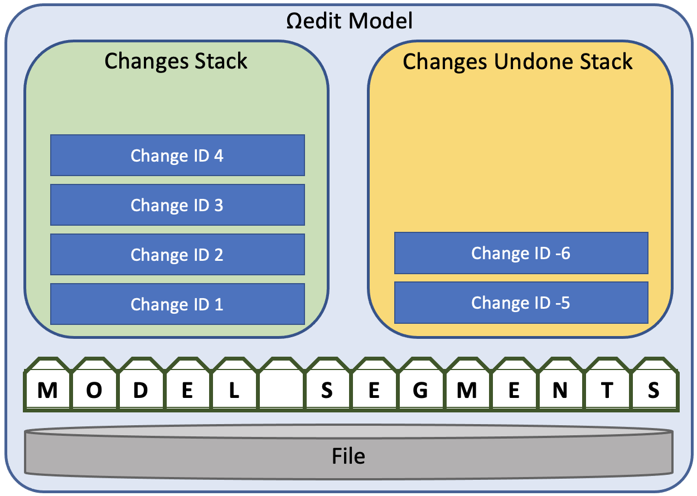

Changes are tracked in the changes stack (Last In, First Out (LIFO)) where new changes are pushed onto the top/front of the stack. The model has another stack that holds changes that are undone. More details on how the stacks work are provided in the Additional Editing Capabilities section. As changes are processed, the model segments are updated. The model segments represent the edited state of the file mathematically (model segments don't actually hold any of the data in memory). Details for how the model segments are computed are provided in the Basic Editing section. The model has read access to the underlying file being edited, which is required for materializing the data (populating a data segment with data) needed for saving and updating viewports.

## Sessions

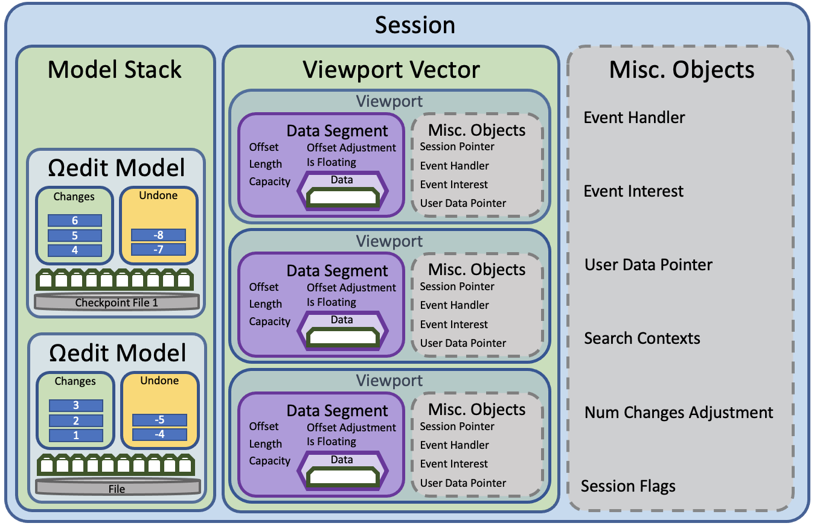

All editing is done using an Ωedit™ session. Sessions represent the editing session and manage all the objects used in Ωedit™. When a session is destroyed, so are all of its associated objects (e.g., models, viewports, and search contexts) and checkpoint files. Sessions control the model stack and the associated viewports. Other miscellaneous objects include items needed for event handling and event interest, session flags (e.g., transaction state, state of various pauses, etc.), num change adjustments needed for change ID bookkeeping when checkpoints are used (more than one model is in the model stack), and search contexts for search context lifecycle management.

```c
// declared in edit.h
omega_session_t *omega_edit_create_session(const char *file_path, omega_session_event_cbk_t cbk,
                                           void *user_data_ptr, int32_t event_interest,
                                           const char *checkpoint_directory);
```

When a session is created, it can be populated with the contents of an existing file, or it can be created empty. A callback function and a pointer to user data can be registered at creation time, which will be called when desired events take place in the session. What is returned is an opaque session pointer to the session object that will be needed for many of the other functions in Ωedit™.

## Basic Editing

### Initial Read

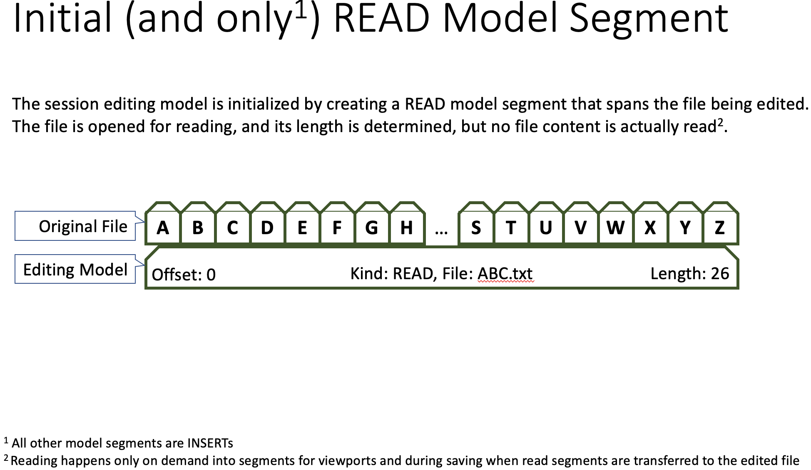

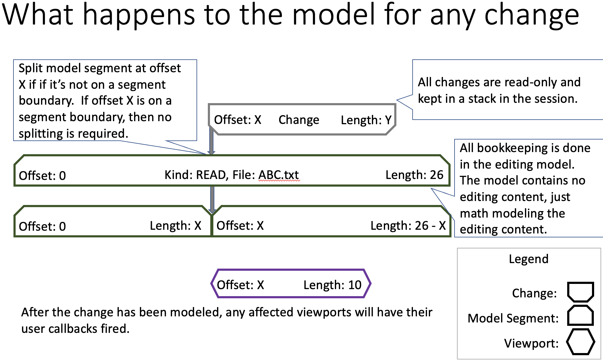

### Delete

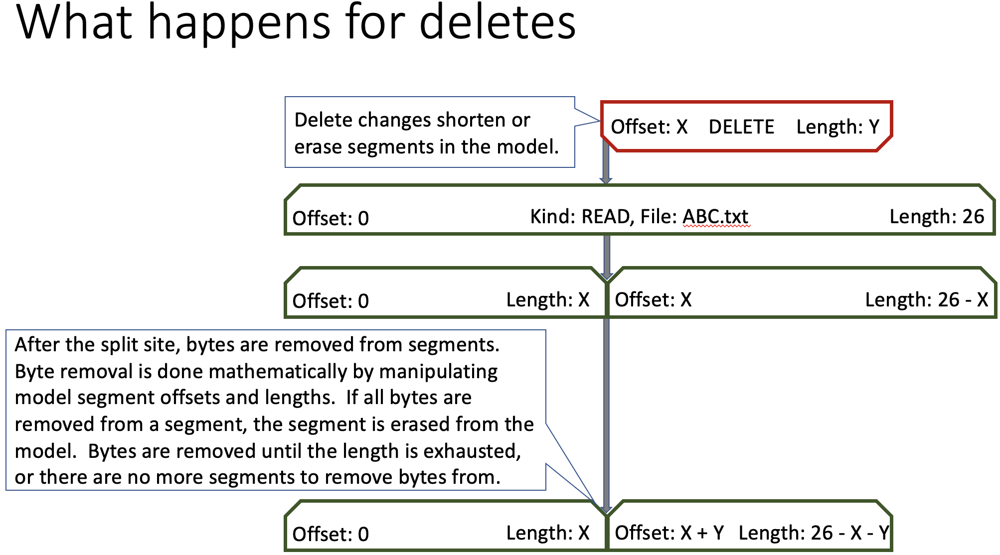

```c
// declared in edit.h
int64_t omega_edit_delete(omega_session_t *session_ptr, int64_t offset, int64_t length);
```

To delete some number of bytes from a session, call `omega_edit_delete` with a session pointer, the offset to begin deleting bytes from, and a number of bytes to delete. What is returned is a positive change serial number, or zero if the delete failed.

### Insert

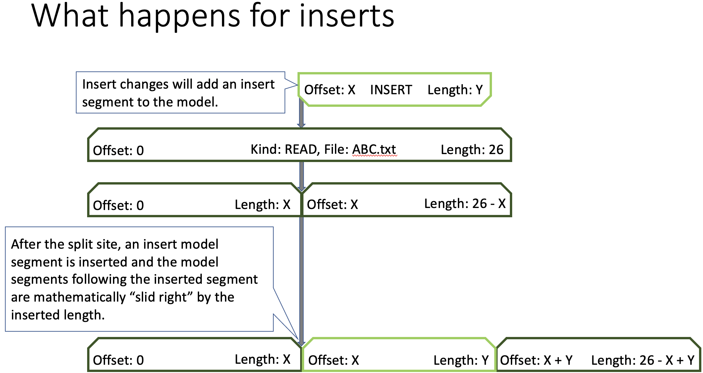

```c
// declared in edit.h
int64_t omega_edit_insert_bytes(omega_session_t *session_ptr, int64_t offset, const omega_byte_t *bytes, int64_t length);
```

To insert byte data into a session, call `omega_edit_insert_bytes` with a session pointer, the offset to insert the bytes at, then a pointer to the bytes, and the number of bytes being pointed to. What is returned is a positive change serial number, or zero if the insert failed.

### Overwrite

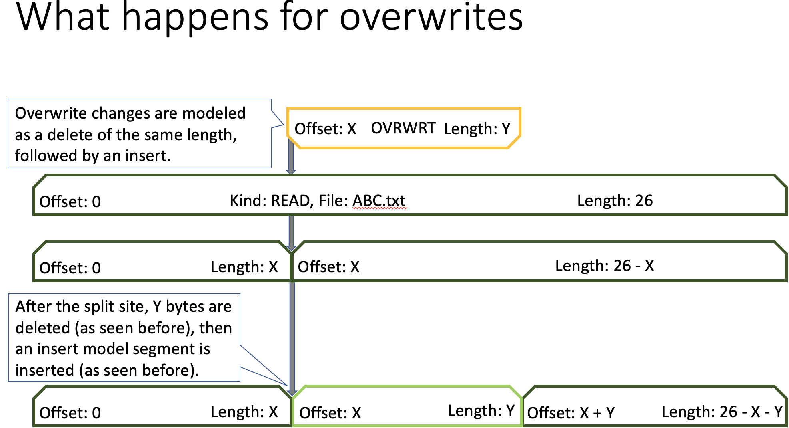

```c
// declared in edit.h
int64_t omega_edit_overwrite_bytes(omega_session_t *session_ptr, int64_t offset, const omega_byte_t *bytes, int64_t length);
```

To overwrite byte data in a session, call `omega_edit_overwrite_bytes` with a session pointer, the offset to overwrite bytes at, then a pointer to the bytes, and the number of bytes being pointed to. What is returned is a positive change serial number, or zero if the overwrite failed.

### Pause And Resume Session Data Changes

There are certain times when an application may need to explicitly suspend session data changes for a period of time. For example, if the application needs to process the entire file, segment at a time. In this scenario, data changes while such processing is taking place, would cause serious performance problems.

```c
// declared in session.h
int omega_session_changes_paused(const omega_session_t *session_ptr);
void omega_session_pause_changes(omega_session_t *session_ptr);
void omega_session_resume_changes(omega_session_t *session_ptr);
```

Call `omega_session_pause_changes` with the desired session to pause changes being made to the session data (e.g., inserts, deletes, overwrites, undo, redo, and transforms). When session changes are paused, the session is essentially "read only", the change ID returned from insert, delete, overwrite, undo, and redo will be 0, and for transform, -1 will be returned. Call `omega_session_resume_changes` on the paused session to allow session data changes to resume. Call `omega_session_changes_paused` to determine if session data changes are paused or not.

## Saving

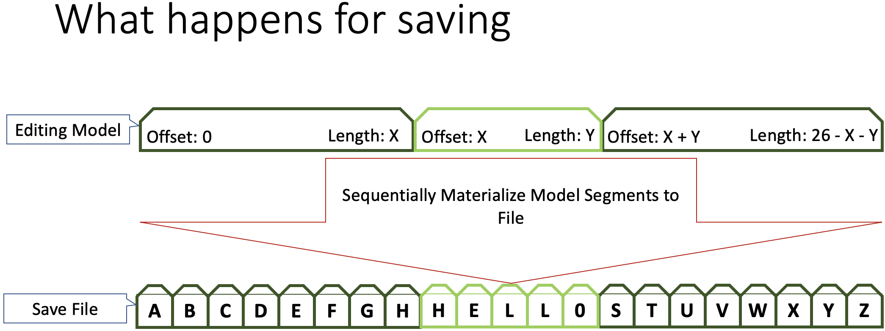

```c
// declared in edit.h
int omega_edit_save(omega_session_t *session_ptr, const char *file_path, int io_flags, char *saved_file_path);
```

To save the edited data in a session to a file, call `omega_edit_save` with the session to save, a file path, and `io_flags` (an `omega_io_flags_t` bitmask, e.g., `IO_FLAGS_OVERWRITE` to overwrite an existing file or `IO_FLAGS_NONE` to leave the original file intact). If the file exists and `IO_FLAGS_OVERWRITE` is set, the file will be overwritten. If the overwritten file is the same as the file being edited by the session, then the session is reset (changes and redos are cleared and the session is now using the new file content for editing). If the file exists and `IO_FLAGS_OVERWRITE` is not set, then save will create a new _incremented_ filename stored in `saved_file_path` (must be able to accommodate FILENAME_MAX bytes). There is also `IO_FLAGS_FORCE_OVERWRITE`, which forces overwriting the original file even if it has been modified outside the session. Zero is returned on success and non-zero otherwise.

### Save Segment

```c
// declared in edit.h
int omega_edit_save_segment(omega_session_t *session_ptr, const char *file_path, int io_flags, char *saved_file_path,
                            int64_t offset, int64_t length);
```

To save a specific segment of the edited data in a session to a file, call `omega_edit_save_segment` with the same parameters as `omega_edit_save` plus a starting `offset` and a `length` in bytes. This allows writing only a portion of the session data to the output file.

## Viewports

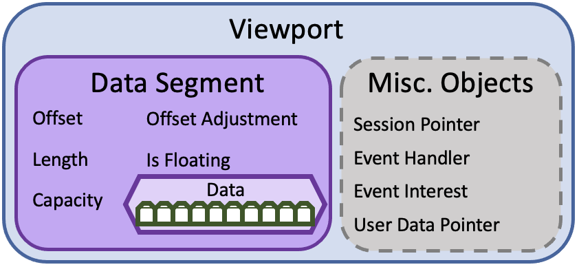

Viewports are used to view data in an associated editing session. A viewport object contains a data segment, which contains information about the capacity and location of the segment, and if it's floating, the offset adjustment. The data in the data segment is materialized on demand, such as when a change affects the data in the viewport, a segment is requested, or the session is being saved to a file. Miscellaneous objects include a pointer to the controlling session, and items for handling viewport events and event interest. This depiction below shows how the data segment is materialized from the model segments in the associated session.

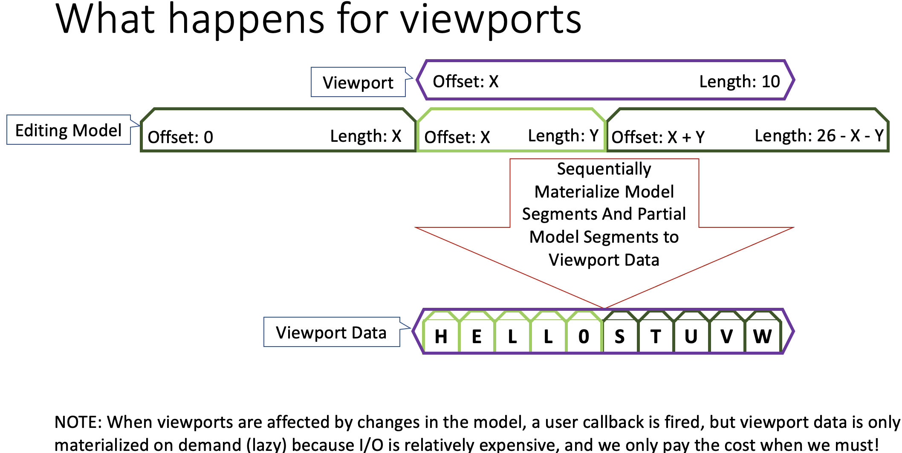

```c
// declared in edit.h
omega_viewport_t *omega_edit_create_viewport(omega_session_t *session_ptr, int64_t offset,
                                             int64_t capacity, int is_floating,
                                             omega_viewport_event_cbk_t cbk, void *user_data_ptr,
                                             int32_t event_interest);
```

Viewports are created and managed in the session. Viewports begin a given offset in the session data and viewports have an associated capacity defined at creation time. If the viewport is floating, that means that inserts and deletes that occur before this viewport's offset will change its offset. For example, if the viewport starts at offset 10, and a single-byte delete happens at offset 5, then the viewport's offset will be adjusted to offset 9, and similarly if say 3 bytes are inserted at offset 7, then the viewport's offset will be adjusted to 3 plus its current offset. If the viewport is not floating, then its offset is fixed and will therefore not be affected by inserts and deletes that occur before this viewport's offset, but instead the viewport data itself will move. For example, if 3 bytes are deleted before the viewport offset, then the data in the viewport will shift to the left by 3 bytes, and if 4 bytes are inserted before the viewport offset, then the data in the viewport will shift to the right by 4 bytes. Changes that happen to data in the viewport or after the viewport do not affect the viewport offset. Like with sessions, viewports also take callback functions, a pointer to user data, which will be called when desired viewport events take place. When data is retrieved from a viewport, that data is the most current state of that data (e.g., all editing changes have been applied) at the time of the retrieval. If a modification is made to a viewport's configuration, a VIEWPORT_EVT_MODIFY event is generated and interested viewport callbacks are called, allowing the application to refresh modified viewports to keep them up to date. Unaffected viewports have not changed, and therefore do not need to be refreshed. What is returned is an opaque viewport pointer which is used by many other functions in Ωedit™, most of which reside in viewport.h. The viewport is managed by the associated session, so if the session is destroyed, so are all of the associated viewports. If a session is still needed, but an associated viewport is no longer needed, the viewport can, and should be, destroyed explicitly.

## Event Callbacks

The Ωedit™ library uses callbacks to inform the application of events of interest. Events that trigger callbacks are listed below. The event void pointer can be cast to point to an object associated with the event. For example, a SESSION_EVT_EDIT event callback can have its session_event_ptr cast as a const omega_change_t * so the callback can get details on the change that caused the SESSION_EVT_EDIT. If the event pointer is not used, it will be set to NULL when sent to the callback function. If there is interest in only certain events, the desired events are or'ed together. If all events are desired, the macro ALL_EVENTS can be used, and conversely if no events are desired, use NULL (in C) or nullptr (in C++) for the callback, and set the event interest to NO_EVENTS.

### Sessions

The table below are the session-level events that will generate a callback if the session creator has expressed interest in the event taking place.

| Event | Description | session_event_ptr |
|---|---|---|
| SESSION_EVT_CREATE | Occurs when the session is successfully created | _not used_ |
| SESSION_EVT_EDIT | Occurs when the session has successfully processed an edit | omega_change_t |
| SESSION_EVT_UNDO | Occurs when the session has successfully processed an undo | omega_change_t |
| SESSION_EVT_CLEAR | Occurs when the session has successfully processed a clear | _not used_ |
| SESSION_EVT_TRANSFORM | Occurs when the session has successfully processed a transform | _not used_ |
| SESSION_EVT_CREATE_CHECKPOINT | Occurs when the session has successfully created a checkpoint | _not used_ |
| SESSION_EVT_DESTROY_CHECKPOINT | Occurs when the session has successfully destroyed a checkpoint | _not used_ |
| SESSION_EVT_SAVE | Occurs when the session has been successfully saved to file | const char * |
| SESSION_EVT_CHANGES_PAUSED | Occurs when the session changes have been paused | _not used_ |
| SESSION_EVT_CHANGES_RESUMED | Occurs when the session changes have been resumed | _not used_ |
| SESSION_EVT_CREATE_VIEWPORT | Occurs when the session has successfully created a viewport | omega_viewport_t |
| SESSION_EVT_DESTROY_VIEWPORT | Occurs when the session has successfully destroyed a viewport | omega_viewport_t |

### Viewports

The table below are the viewport-level events that will generate a callback if the viewport creator has expressed interest in the event taking place.

| Event | Description | viewport_event_ptr |
|---|---|---|
| VIEWPORT_EVT_CREATE | Occurs when the viewport is successfully created | _not used_ |
| VIEWPORT_EVT_EDIT | Occurs when an edit affects the viewport | omega_change_t |
| VIEWPORT_EVT_UNDO | Occurs when an undo affects the viewport | omega_change_t |
| VIEWPORT_EVT_CLEAR | Occurs when a clear affects the viewport | _not used_ |
| VIEWPORT_EVT_TRANSFORM | Occurs when a transform affects the viewport | _not used_ |
| VIEWPORT_EVT_MODIFY | Occurs when the viewport itself has been modified | _not used_ |
| VIEWPORT_EVT_CHANGES | Occurs when the viewport has changes to its data from some other activity | _not used_ |

#### Pausing Viewport Events

There may be times when viewport events need to be paused for some amount of time or activity.

```c
// declared in session.h
int omega_session_viewport_event_callbacks_paused(const omega_session_t *session_ptr);
void omega_session_pause_viewport_event_callbacks(omega_session_t *session_ptr);
void omega_session_resume_viewport_event_callbacks(omega_session_t *session_ptr);
int omega_session_notify_changed_viewports(const omega_session_t *session_ptr);
```

To pause viewport events from being generated, call `omega_session_pause_viewport_event_callbacks` with the desired session, and then to resume the callbacks, call `omega_session_resume_viewport_event_callbacks` with the same session. Call `omega_session_viewport_event_callbacks_paused` to determine if the session's viewport callbacks are paused or not. For example when doing search and replace, as implemented in `core/src/examples/replace.cpp`, viewport events are paused when the original search pattern is deleted, then events are resumed before the replacement string is inserted. Viewport events are paused for the delete, then resumed before the insert, causing viewport refreshes to occur just once for each replacement, showing the pattern being immediately replaced with the replacement string, rather than showing the delete of the pattern followed by the insert of the replacement. It is recommended that bulk operations like replacing all patterns with another pattern that viewport events be paused before the bulk operation, then resumed after the bulk operation. During the bulk operation viewport data might have been changed, so after resuming viewport events, call `omega_session_notify_changed_viewports` so that the updated data can be read from the changed viewports.

## Putting The Basics Together

There are several example programs in `core/src/examples` that demonstrate many of the capabilities of Ωedit™. Included are 2 simple examples of doing basic editing, one is a C program using the Ωedit™ C API and the other is a C++ program using the Ωedit™ `stl_string_adaptor.hpp`. The 2 simple examples are included below for reference.

### C

```c
//
// See core/src/examples/simple_c.c
//

#include <omega_edit.h>
#include <stdio.h>
#include <stdlib.h>

void vpt_change_cbk(const omega_viewport_t *viewport_ptr, omega_viewport_event_t viewport_event,
                    const void *viewport_event_ptr) {
    switch (viewport_event) {
        case VIEWPORT_EVT_CREATE:
        case VIEWPORT_EVT_EDIT: {
            char change_kind = viewport_event_ptr
                                       ? omega_change_get_kind_as_char((const omega_change_t *) (viewport_event_ptr))
                                       : 'R';
            fprintf((FILE *) (omega_viewport_get_user_data_ptr(viewport_ptr)), "%c: [%s]\n", change_kind,
                    omega_viewport_get_data(viewport_ptr));
            break;
        }
        default:
            abort();
            break;
    }
}

int main() {
    omega_session_t *session_ptr = omega_edit_create_session(NULL, NULL, NULL, NO_EVENTS, NULL);
    omega_edit_create_viewport(session_ptr, 0, 100, 0, vpt_change_cbk, stdout, VIEWPORT_EVT_CREATE | VIEWPORT_EVT_EDIT);
    omega_edit_insert(session_ptr, 0, "Hello Weird!!!!", 0);
    omega_edit_overwrite(session_ptr, 7, "orl", 0);
    omega_edit_delete(session_ptr, 11, 3);
    omega_edit_save(session_ptr, "hello.txt", IO_FLAGS_OVERWRITE, NULL);
    omega_edit_destroy_session(session_ptr);
    return 0;
}
```

### C++

```cpp
//
// See core/src/examples/simple.cpp
//

#include <iostream>
#include <omega_edit/stl_string_adaptor.hpp>

using namespace std;

inline void vpt_change_cbk(const omega_viewport_t *viewport_ptr, omega_viewport_event_t viewport_event,
                           const void *viewport_event_ptr) {
    switch (viewport_event) {
        case VIEWPORT_EVT_CREATE:
        case VIEWPORT_EVT_EDIT: {
            char change_kind = (viewport_event_ptr)
                                       ? omega_change_get_kind_as_char(
                                                 reinterpret_cast<const omega_change_t *>(viewport_event_ptr))
                                       : 'R';
            clog << change_kind << ": [" << omega_viewport_get_string(viewport_ptr) << "]" << endl;
            break;
        }
        default:
            break;
    }
}

int main() {
    const auto session_ptr = omega_edit_create_session(nullptr, nullptr, nullptr, NO_EVENTS, nullptr);
    omega_edit_create_viewport(session_ptr, 0, 100, 0, vpt_change_cbk, nullptr, VIEWPORT_EVT_CREATE | VIEWPORT_EVT_EDIT);
    omega_edit_insert_string(session_ptr, 0, "Hello Weird!!!!");
    omega_edit_overwrite_string(session_ptr, 7, "orl");
    omega_edit_delete(session_ptr, 11, 3);
    omega_edit_save(session_ptr, "hello.txt", omega_io_flags_t::IO_FLG_NONE, nullptr);
    omega_edit_destroy_session(session_ptr);
    return 0;
}
```

## Additional Editing Capabilities

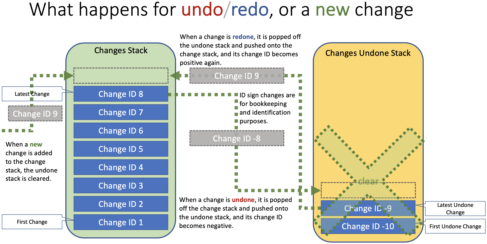

### Undo

```c
// declared in edit.h
int64_t omega_edit_undo_last_change(omega_session_t *session_ptr);
```

To undo the last change to a session, call `omega_edit_undo_last_change` with the session to undo the last change from. What is returned is a _negative_ serial number of the undone change if successful, and zero otherwise.

### Redo

```c
// declared in edit.h
int64_t omega_edit_redo_last_undo(omega_session_t *session_ptr);
```

To redo the last undone change to a session, call `omega_edit_redo_last_undo` with a session to redo the last undo. What is returned is the positive serial number of the redone change if successful, and zero otherwise.

### Clear

```c
// declared in edit.h
int omega_edit_clear_changes(omega_session_t *session_ptr);
```

To clear all changes made to a session, call `omega_edit_clear_changes` with the session to clear all changes and changes undone from. Zero is returned on success or non-zero on failure.

## Search

```c
// declared in search.h
omega_search_context_t *
omega_search_create_context_bytes(omega_session_t *session_ptr, const omega_byte_t *pattern,
                                  int64_t pattern_length, int64_t session_offset, int64_t session_length,
                                  int case_insensitive, int is_reverse_search);
```

To search a segment of data in a session for a byte pattern, first create a search context using the `omega_search_create_context_bytes` function. The function takes the session to search, the byte pattern to search for, the byte pattern length, the session offset to start the search, then the number of bytes out from the given session offset to search, if the search should be case insensitive or not (zero for case sensitive searching and non-zero otherwise), and finally whether the search should proceed in reverse (zero for forward search, non-zero for reverse). What is returned is an opaque search context pointer that can be iterated over to find matches.

There is also a convenience variant that accepts a C string instead of raw bytes:

```c
// declared in search.h
omega_search_context_t *
omega_search_create_context(omega_session_t *session_ptr, const char *pattern,
                            int64_t pattern_length, int64_t session_offset, int64_t session_length,
                            int case_insensitive, int is_reverse_search);
```

For a simple example, see `core/src/examples/search.cpp`, and to see how search and replace can be implemented, see `core/src/examples/replace.cpp`. When the search context is no longer required, destroy it with `omega_search_destroy_context`. Search context memory is managed by the associated session, so if the session is destroyed, so are all of the associated search contexts.

## Transactions

```c
// declared in session.h
int omega_session_begin_transaction(omega_session_t *session_ptr);
int omega_session_end_transaction(omega_session_t *session_ptr);
int omega_session_get_transaction_state(const omega_session_t *session_ptr);
int64_t omega_session_get_num_change_transactions(const omega_session_t *session_ptr);
int64_t omega_session_get_num_undone_change_transactions(const omega_session_t *session_ptr);
```

To bundle a series of edit operations together so that they can be undone / redone in a single undo or redo operation, call `omega_session_begin_transaction` before issuing the series of edit operations, then call `omega_session_end_transaction` to complete the transaction. The single edits will still behave the same way as they do outside of a transaction, with the data being updated, events being generated and so on. The number of transactions define the number of undos and redos available. Individual changes outside of declared transactions are implicit transactions containing the single change. If no transactions were used, the numbers returned from `omega_session_get_num_change_transactions` and `omega_session_get_num_undone_change_transactions` will be the number of changes in their respective stacks. If there are transactions that bundle two or more changes, then `omega_session_get_num_change_transactions` and `omega_session_get_num_undone_change_transactions` will have counts that will be less than the change counts for their respective stacks. Use transactions when a series of changes need to be undone and redone atomically (e.g., replace operations where the length of the data being replaced is different than the length of the replacement, so use a transaction containing a delete of the data being replaced, followed by an insert of the replacement data so that an undo undoes those 2 operations with a single undo call).

## Checkpoints

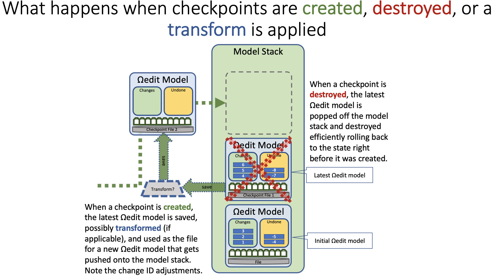

```c
// declared in edit.h
int omega_edit_create_checkpoint(omega_session_t *session_ptr);
int omega_edit_destroy_last_checkpoint(omega_session_t *session_ptr);
```

In Ωedit™, checkpoints create a file on disk with all the current changes made, and the change and redo stacks are pushed into a checkpoint stack. After the checkpoint, changes and undos made to these changes are put into new stacks. Checkpoints can be used in circumstances where changes would take up a large amount of memory, so we make those large changes to a checkpoint file, then continue making changes from that new baseline (see Byte Transforms). This allows keeping the change history and the ability to do undos intact, trading storage space for memory efficiency. Checkpoints can be created using `omega_edit_create_checkpoint` and destroyed using `omega_edit_destroy_last_checkpoint` explicitly by the user, or they may be required by the library (as is the case with applying byte transforms). The checkpoint directory is configured when the session is created (via the `checkpoint_directory` parameter of `omega_edit_create_session`). If a checkpoint is destroyed, session state returns to where it was just prior to the checkpoint creation (this is also known as "rollback"). Transactional editing systems could potentially be built using Ωedit™'s checkpointing capabilities.

## Byte Transforms

```c
// declared in utility.h
typedef omega_byte_t (*omega_util_byte_transform_t)(omega_byte_t, void *user_data);

// declared in edit.h
int omega_edit_apply_transform(omega_session_t *session_ptr, omega_util_byte_transform_t transform, void *user_data_ptr,
                               int64_t offset, int64_t length);
```

The Ωedit™ library has support for pluggable byte transforms with the capability of changing every byte in a session or large segments thereof. To handle possibly very large changes, checkpoints are used for memory efficiency. For example, if all the ascii alphabetic characters in a session should be upper case, we can write that code in C++ as follows:

```cpp
// define to_upper transform
omega_byte_t to_upper(omega_byte_t byte, void *) { return toupper(byte); }

...
// apply the transform to bytes in a session (0 length means all bytes after the given offset)
omega_edit_apply_transform(session_ptr, to_upper, nullptr, 0, 0);
```

For another more involved example, suppose a configurable bit mask is to be applied to a specific segment of bytes in a session:

```cpp
// define a mask info struct
typedef struct mask_info_struct {
    omega_byte_t mask;
    omega_mask_kind_t mask_kind;
} mask_info_t;

// define a byte mask transform
omega_byte_t byte_mask_transform(omega_byte_t byte, void *user_data_ptr) {
    const auto mask_info_ptr = reinterpret_cast<mask_info_t *>(user_data_ptr);
    // see omega_util_mask_byte in utility.h
    return omega_util_mask_byte(byte, mask_info_ptr->mask, mask_info_ptr->mask_kind);
}

...
// create and configure mask info
mask_info_t mask_info;
mask_info.mask_kind = MASK_XOR;
mask_info.mask = 0xFF;

// apply the transform to 26 bytes, starting at offset 10
omega_edit_apply_transform(session_ptr, byte_mask_transform, &mask_info, 10, 26)
```

A full, but simple, example of applying uppercase and lowercase transforms in an editing session can be found in `core/src/examples/transform.c`.

## Metrics

During the course of editing and testing, there are several helpful metrics that are available in the library and in the RPC services. The available metrics are listed in the table below.

| RPC CountKind | C/C++ Library Function | Description |
|---|---|---|
| COUNT_COMPUTED_FILE_SIZE | omega_session_get_computed_file_size | computed file size (with changes applied) in bytes |
| COUNT_CHANGES | omega_session_get_num_changes | number of active changes |
| COUNT_UNDOS | omega_session_get_num_undone_changes | number of undone changes eligible for being redone |
| COUNT_VIEWPORTS | omega_session_get_num_viewports | number of active viewports |
| COUNT_CHECKPOINTS | omega_session_get_num_checkpoints | number of session checkpoints |
| COUNT_SEARCH_CONTEXTS | omega_session_get_num_search_contexts | number of active search contexts |
| COUNT_CHANGE_TRANSACTIONS | omega_session_get_num_change_transactions | number of change transactions |
| COUNT_UNDO_TRANSACTIONS | omega_session_get_num_undone_change_transactions | number of undone change transactions |

### Multi-byte Characters

Another set of metrics provides information on Multi-byte characters. Multi-byte characters are detected based on a Byte Order Mark (BOM) detected at the beginning of a file. If no BOM is detected, UTF-8 is assumed. The following table describes the various BOMs detected in Ωedit™:

| BOM Enum | BOM Bytes | BOM Length | BOM as string | Bytes Per Character | Description |
|---|---|---|---|---|---|
| BOM_NONE | | 0 | "none" | 1 | No BOM detected |
| BOM_UTF8 | EF BB BF | 3 | "UTF-8" | 1, 2, 3, or 4 | UTF-8 BOM detected |
| BOM_UTF16LE | FF FE | 2 | "UTF-16LE" | 2 or 4 | UTF-16 Little Endian BOM detected |
| BOM_UTF16BE | FE FF | 2 | "UTF-16BE" | 2 or 4 | UTF-16 Big Endian BOM detected |
| BOM_UTF32LE | FF FE 00 00 | 4 | "UTF-32LE" | 4 | UTF-32 Little Endian BOM detected |
| BOM_UTF32BE | 00 00 FE FF | 4 | "UTF-32BE" | 4 | UTF-32 Big Endian BOM detected |

Given a segment in a session, the following function is provided for the purpose of profiling the character counts:

```c
/**
 * Given a session, offset and length, populate character counts
 * @param session_ptr session to count characters in
 * @param counts_ptr pointer to the character counts to populate
 * @param offset where in the session to begin counting characters
 * @param length number of bytes from the offset to stop counting characters (if 0, it will count to the end of the session)
 * @param bom byte order marker (BOM) to use when counting characters
 * @return zero on success and non-zero otherwise
 */
int omega_session_character_counts(const omega_session_t *session_ptr, omega_character_counts_t *counts_ptr,
                                   int64_t offset, int64_t length, omega_bom_t bom);
```

The `omega_character_counts_t` object is created, destroyed, queried, and mutated using the following functions:

```c
// defined in character_counts.h

/**
 * Create a new omega_character_counts_t object
 * @return new omega_character_counts_t object
 */
omega_character_counts_t *omega_character_counts_create();

/**
 * Destroy an omega_character_counts_t object
 * @param counts_ptr omega_character_counts_t object to destroy
 */
void omega_character_counts_destroy(omega_character_counts_t *counts_ptr);

/**
 * Reset an omega_character_counts_t object
 * @param counts_ptr omega_character_counts_t object to reset
 * @return pointer to the reset omega_character_counts_t object
 */
omega_character_counts_t *omega_character_counts_reset(omega_character_counts_t *counts_ptr);

/**
 * Get the byte order mark (BOM) for the given omega_character_counts_t object
 * @param counts_ptr omega_character_counts_t object to get the BOM from
 * @return BOM for the given omega_character_counts_t object
 */
omega_bom_t omega_character_counts_get_BOM(const omega_character_counts_t *counts_ptr);

/**
 * Set the byte order mark (BOM) for the given omega_character_counts_t object
 * @param counts_ptr omega_character_counts_t object to set the BOM for
 * @param bom BOM to set for the given omega_character_counts_t object
 * @return pointer to the updated omega_character_counts_t object
 */
omega_character_counts_t *omega_character_counts_set_BOM(omega_character_counts_t *counts_ptr, omega_bom_t bom);

/**
 * Get the number of BOM bytes found for the given omega_character_counts_t object
 * @param counts_ptr omega_character_counts_t object to get the number of BOM bytes from
 * @return number of BOM bytes found for the given omega_character_counts_t object
 */
int64_t omega_character_counts_bom_bytes(const omega_character_counts_t *counts_ptr);

/**
 * Get the number of single byte characters for the given omega_character_counts_t object
 * @param counts_ptr omega_character_counts_t object to get the number of single byte characters from
 * @return number of single byte characters for the given omega_character_counts_t object
 */
int64_t omega_character_counts_single_byte_chars(const omega_character_counts_t *counts_ptr);

/**
 * Get the number of double byte characters for the given omega_character_counts_t object
 * @param counts_ptr omega_character_counts_t object to get the number of double byte characters from
 * @return number of double byte characters for the given omega_character_counts_t object
 */
int64_t omega_character_counts_double_byte_chars(const omega_character_counts_t *counts_ptr);

/**
 * Get the number of triple byte characters for the given omega_character_counts_t object
 * @param counts_ptr omega_character_counts_t object to get the number of triple byte characters from
 * @return number of triple byte characters for the given omega_character_counts_t object
 */
int64_t omega_character_counts_triple_byte_chars(const omega_character_counts_t *counts_ptr);

/**
 * Get the number of quad byte characters for the given omega_character_counts_t object
 * @param counts_ptr omega_character_counts_t object to get the number of quad byte characters from
 * @return number of quad byte characters for the given omega_character_counts_t object
 */
int64_t omega_character_counts_quad_byte_chars(const omega_character_counts_t *counts_ptr);

/**
 * Get the number of invalid sequences for the given omega_character_counts_t object
 * @param counts_ptr omega_character_counts_t object to get the number of invalid sequences from
 * @return number of invalid sequences for the given omega_character_counts_t object
 */
int64_t omega_character_counts_invalid_bytes(const omega_character_counts_t *counts_ptr);
```

Given a BOM enum, the following function provides the string version of the BOM and the size of the BOM in bytes:

```c
// declared in utility.h

/**
 * Convert the given byte order mark (BOM) to a string
 * @param bom byte order mark (BOM) to convert
 * @return string representation of the given BOM ("none", "UTF-8", "UTF-16LE", "UTF-16BE", "UTF-32LE", "UTF-32BE")
 */
char const *omega_util_BOM_to_cstring(omega_bom_t bom);

/**
 * Given a byte order mark (BOM), return the size of the byte order mark (BOM) in bytes
 * @param bom byte order mark (BOM) to get the size of
 * @return size of the byte order mark (BOM) in bytes
 */
size_t omega_util_BOM_size(omega_bom_t bom);
```

## Integration Beyond C/C++

The choice to implement the Ωedit™ library using a C API was made to maximize integration possibilities across programming languages, operating systems, and hardware platforms.

## Remote Procedure Call (RPC)

### Server

For maximum deployment flexibility and loosely coupled integrations, Ωedit™ ships with an RPC server implemented natively in C++ as a standalone binary.

### Client

Ωedit™ includes a TypeScript RPC client to make it easy to extend JavaScript or TypeScript backed editors (like Visual Studio Code). For example, the Apache Daffodil™ VS Code Extension uses Ωedit™ as its data editor engine. The extension starts up the Ωedit™ RPC server and interacts with the server using the Ωedit™ TypeScript client.

### Services

The Ωedit™ RPC services are efficiently implemented using gRPC ([https://grpc.io](https://grpc.io)). The RPC services and messages are defined using Google protocol buffers, in `proto/omega_edit/v1/omega_edit.proto`, from which stub code for the server and client are generated. Server stubs are generated and implemented in C++ (in `server/cpp/src`) and client stubs are generated and implemented in TypeScript (in `packages/client/src`).

#### Event Streams

gRPC uses HTTP/2, which among other benefits, provides single and bidirectional streaming. Ωedit™ uses two single directional streams to stream session, and viewport event information, from the server to the client.

## Testing

Ωedit™ is implemented in layers. First there is the library, written in C/C++. Layered on top of that is the native C++ gRPC server. Finally, there is the TypeScript RPC client, that uses the C++ gRPC server, that uses the C/C++ library. These layers provide several opportunities for testing.

## Library Testing

The Ωedit™ C/C++ library is tested using Catch2. The test code is in `core/src/tests/`. This test suite is run in myriad static and shared configurations using cmake's `ctest` tool and test configurations found in `core/src/tests/CMakeLists.txt`.

## C++ gRPC Server Testing

The C++ gRPC server is built and validated as part of the TypeScript client test suite, which starts the server and exercises the full RPC stack end-to-end.

## TypeScript RPC Client Testing

The Ωedit™ TypeScript RPC client is tested using `yarn test`, which executes mocha tests defined in `packages/client/tests/specs/`. The client interacts with the C++ gRPC server.

## Robustness and Reliability

Ωedit™ is engineered for production use in data-sensitive environments. Its reliability rests on several complementary layers of defense.

### Cross-Platform CI

Every commit is built and tested across a wide matrix of platforms and configurations:

| Platform | Versions | Architecture |
|---|---|---|
| Windows | Server 2022, 2025 | x86_64 |
| Linux | Ubuntu 22.04, 24.04 | x86_64, ARM64 |
| macOS | 14, 15 | Universal (x86_64 + arm64) |

CI workflows (in `.github/workflows/tests.yml`) exercise native library builds, the C++ gRPC middleware, and the TypeScript client on each platform, ensuring cross-platform correctness is continuously verified.

### Test Coverage

The Catch2 test suite spans 70+ test cases across dedicated test files covering:

- **Core editing operations** — insert, delete, overwrite, undo, redo, clear (`core/src/tests/omegaEdit_tests.cpp`)
- **Edge cases** — single-byte inserts, empty sessions, operations beyond EOF, UTF-8 multi-byte sequences, rapid insert/delete cycles (`core/src/tests/edge_case_tests.cpp`)
- **Viewport stress** — 25+ simultaneous viewports under interleaved edits, floating viewport offset tracking (`core/src/tests/viewport_stress_tests.cpp`)
- **Session lifecycle** — checkpoints, large transaction undo/redo, checkpoint rollback (`core/src/tests/session_tests.cpp`)
- **File system** — file copy, EOL handling, emoji filenames, path edge cases (`core/src/tests/filesystem_tests.cpp`)
- **Null pointer safety** — null-guard tests appear in multiple test files to verify that the API handles invalid inputs gracefully rather than crashing

Code coverage is collected using lcov/gcov with branch coverage enabled, uploaded to Codecov, and held to an 85–100% target range (configured in `.github/codecov.yml`).

### Static Analysis

GitHub CodeQL runs on every push and pull request to `main` (plus a weekly schedule), scanning both C++ and TypeScript for security and correctness issues (`.github/workflows/codeql-analysis.yml`).

### Memory Safety

The library uses several layers to prevent leaks and corruption:

- **Valgrind integration.** A `valgrind` custom target in `core/src/tests/CMakeLists.txt` runs tests under `--leak-check=full --show-leak-kinds=all --track-origins=yes`, catching leaks and use-after-free during development.
- **Smart pointers and RAII.** Internal code manages changes with `std::shared_ptr`, model segments with `std::unique_ptr`, and I/O buffers with `std::unique_ptr<omega_byte_t[]>`. These ensure automatic cleanup even on exceptional paths.
- **Small-data optimization.** Changes smaller than a threshold are stored inline in the change struct, avoiding a heap allocation entirely.
- **Deterministic destruction.** When a session is destroyed, all owned objects — models, viewports, search contexts, checkpoint files — are torn down in a defined order before the session itself is freed.

### Defensive Error Handling

Public API functions validate inputs at the boundary:

- Null session and viewport pointers are checked before use; functions return zero or null to signal failure rather than dereferencing invalid memory.
- File I/O operations check return codes from `fopen`, `fseek`, `fwrite`, and friends, returning error codes and logging diagnostics on failure.
- Viewport capacity is range-validated at creation time.
- Transforms that would exceed session bounds are rejected with an error.

### Checkpoint Integrity

When a session is created against an existing file, Ωedit™ copies the original file into a uniquely-named checkpoint file with restricted permissions (`0600`). This guarantees that even if the original file is modified externally, the session retains a consistent baseline for data materialization. Checkpoint files are automatically cleaned up when the session is destroyed, and `IO_FLG_FORCE_OVERWRITE` versus `IO_FLG_OVERWRITE` gives the caller explicit control over what happens when the on-disk file has diverged from the session's baseline.
